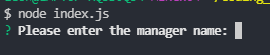
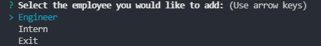

# Team Profile Generator

## Description

The Team Profile Generator allows you to create a Team page with a Manager and as many Engineers & Interns as you would like using the command line. Once you enter their details, a card is dynamically created in the HTML file with the inputted information. They also have some unique properties, Manager has the Office Number, Engineers have a GitHub link, and Interns have their school.

## Table of Contents

- [Team Profile Generator](#team-profile-generator)
  - [Description](#description)
  - [Table of Contents](#table-of-contents)
  - [Installation](#installation)
  - [Usage](#usage)
  - [Screenshots](#screenshots)
  - [Tech/framework used](#techframework-used)
  - [Features](#features)
  - [Scripts](#scripts)
  - [Tests](#tests)
  - [Contact](#contact)

## Installation

```
npm install
```

## Usage

Run 'node index.js' from the /src folder and answer the given prompts.

The generated HTML is located in the '/dist/' folder.

## Screenshots

**Command Line:**

Here is an example of the prompt for the Manager name:  


Choices for Engineer or Intern:  


**Generated HTML:**

Here is an example of the generated Team Profile:  


## Tech/framework used

<b>Built with</b>

- [Node.js](https://nodejs.org/en/)
- [Inquirer.js](https://www.npmjs.com/package/inquirer)

## Features

- Generate a card with Manager details
- Generate cards with Engineer details
- Generate cards with Intern details

## Scripts

You can use the below scripts to run the app or start some tests:

```
npm start
npm test
npm test:watch
```

## Tests

WIP

## Contact

For any issues, please contact [my email](mailto:leonwheeler08@gmail.com) 😀
